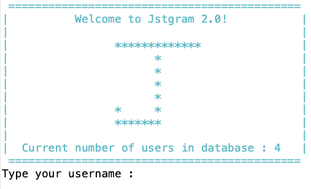
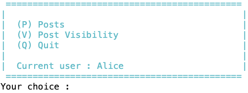
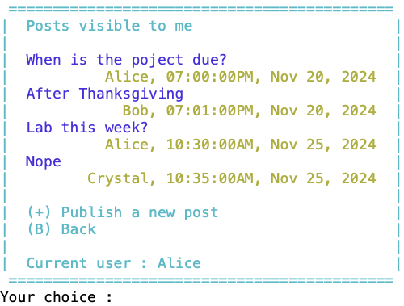
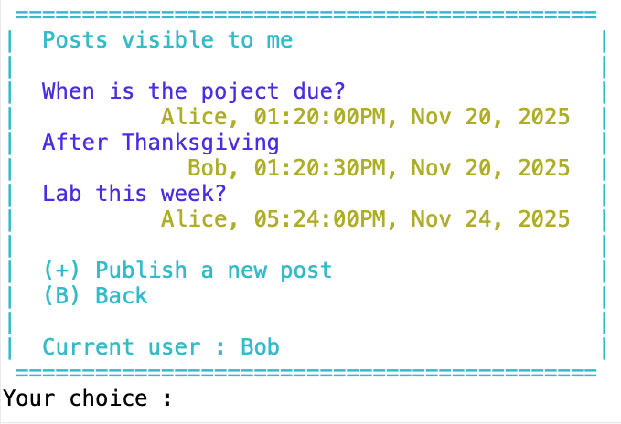
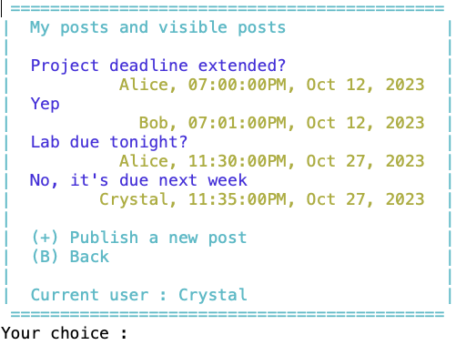
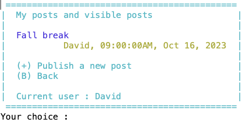
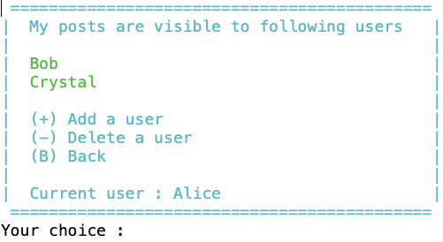
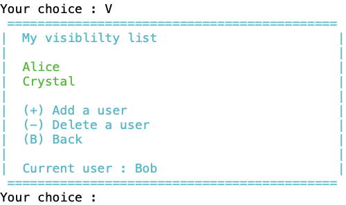
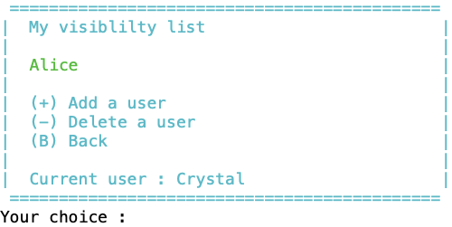
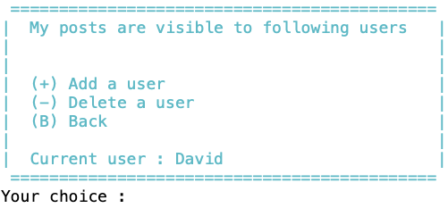

# Computer Science II
## Project - Database

This project is part of  Computer Science II (CSCE 156) for Fall 2024 
in the [School of Computing](https://computing.unl.edu) 
at the [University of Nebraska-Lincoln](https://www.unl.edu).

## Overview

### Lab Objectives & Topics

After completing this lab, you should be able to:
* Establish a JDBC connection to a database server
* Use JDBC to query and process a result set from a database server
* Use JDBC to insert new data into or delete existing data from a database
* Design database tables in 3NF (Third Normal Form) 


### Peer Programming Pair-Up

At the beginning of each project, you may find a team member on your own.  Please ***sign
up for a group on Canvas*** (`People`, then `Groups`, and then join a group for Project 2), and only one group member needs to
submit your project on Canvas.  If you prefer to work on this project by yourself, that is fine too.


## 1. Relation to Project 1

This project is independent of Project 1, although both projects develop Jstgram. You do not need to reuse your code from Project 1. In fact, it is recommended not to use your Project 1 code due to the significant differences between these two projects.


## 2. Social Media Application - Jstgram

In this project, we will design and develop a database version for *Jstgram*. 

### 2.1 Database

All information should be stored on the database server `nuros.unl.edu`. Please write a MySQL initialization script to set up the database before Jstgram starts. The MySQL initialization script creates the tables and inserts the predefined user and post data as specified below.

### 2.2 Users

To simplify the project, your application does not need to support adding or deleting users. Instead, we will use the MySQL initialization script to add a predefined group of users to the database. 

A user can log into Jstgram using their unique username and password. 

Your MySQL initialization script should add the following information to the database before Jstgram starts.
*  Four users with usernames: Alice, Bob, Crystal, and David, and their respective passwords: Alice123, Bob123, Crystal123, and David123.

### 2.3 Posts

To simplify the project, your application only needs to support the text posts. That is, users can publish text posts only (no text art posts as in Project 1).

Your MySQL initialization script should add the following information to the database before Jstgram starts.
  * Alice posted "When's the project due?" at 19:00:00 on November 20, 2024
  * Bob posted "After Thanksgiving" at 19:01:00 on November 20, 2024
  * David posted "Great job, me" at 09:00:00 on November 21, 2024
  * Alice posted "Lab this week?" at 10:30:00 on November 25, 2024
  * Crystal posted "Nope" at 10:35:00 on November 25, 2024

### 2.4 Post Visibility

A user can manage who sees the user's posts by setting a visibility list. A post is visible to those included in this list, as well as to the user who made the post. 

Your MySQL initialization script should add the following visibility lists to the database before Jstgram starts.
  * The visibility list of Alice contains Bob and Crystal. That is, Alice's posts are visible to Bob, Crystal, and Alice.
  * The visibility list of Bob contains Alice and Crystal.
  * The visibility list of Crystal contains Alice.
  * The visibility list of David is empty. That is, David's posts are visible to only David.


  
## 3. Jstgram Windows

### 3.1 Main Window

When Jstgram starts, it should first connect to the database server and retrieve the current number of users in the database (as added by your MySQL initialization script). If successful, it displays that information in the *Main Window* as shown below. 

<p align="center">

</p>  

It then prompts for the username and password. If these credentials match the information in the database, this user becomes the current user, and Jstgram proceeds to the *Account Window*.

### 3.2 Account Window

The *Account Window* for Alice is shown below as an example. 

<p align="center">

</p>  
 
The current user can choose to view posts, edit post visibility, or quit the application.

### 3.3 Post Window

The *Post Window* lists all posts visible to the current user in the *ascending* order of post times. 

Below are examples of the *Post Window* for Alice, Bob, Crystal, and David, respectively, based on the database initialized with the MySQL script. Note that different users see different lists of posts. For example, Crystal can see the posts of Alice, Bob, and Crystal, because both Alice's and Bob's posts are visible to Crystal. 

<p align="center">




</p>  

The current user can choose to publish a new post, or return back to the *Account Window*. If a new post is published, both the database and the *Post Window* should be updated accordingly.

### 3.4  Visibility Window

The *Visibility Window* shows the visibility list of the current user. 

Below are examples of the Visibility Window for Alice, Bob, Crystal, and David, respectively, based on the database initialized with the MySQL script.

<p align="center">




</p>  


The current user can choose to add a user to their visibility list, delete a user from their visibility list, or go back to the account window. If a user is added or deleted, both the database and the *Visibility Window* should be updated accordingly.

Note that, only a user already in the database can be added to the visibility list, and only a user already in the visibility list can be deleted from the visibility list.

## 4. Project Requirement

### 4.1 Database Design

Design a database to capture the following information

  * User details: userID, username, password, visibility list, where userID is unique and username is also unique.
  * Post details: postID, postText, postTime, the user who published the post. 

Feel free to add additional information as needed. Feel free to name your tables and attributes. If you plan to use natural join, ensure at least one common column between the two tables.

Your tables must adhere to the third normal form (3NF), meaning they should have no group of values for an attribute, no partial dependencies, and no transitive dependencies.

You will write the MySQL initialization script from scratch. Name it `dbinit.sql`.

***Recommendation***

  * Utilize `auto_increment` for primary keys to avoid keeping track of the largest integer in Java when inserting new rows.
  * Use `int`, `varchar(n)`, and `char(n)` data types that we have studied and are familiar with.
  * Define postTime (i.e., the date and time of a post) as a `varchar(255)` in the database and as `LocalDateTime` in Java. From database to Java: use `LocalDateTime.parse(String)` to convert a postTime from a string to a `LocalDateTime`. From Java to database: use `postTime.format(DateTimeFormatter.ofPattern("yyyy-MM-dd'T'HH:mm:ss")` to convert a postTime from a `LocalDateTime` to a string in the specified format. In addition, use `LocalDateTime.now()` in Java to get the current date and time. 
  * If necessary,  use the more flexible `on` clause for a join select statement. For example, `Table1 natural inner join Table2` is equivalent to `Table1 inner join Table2 on Table1.col=Table2.col` if they have a common column `col`. The `on` clause is more flexible because it can join two tables on columns with different  names or only some common columns.

### 4.2 Java Code Design

Write your Java program to correctly show the necessary information in each window (e.g., list of posts in the *Post Window*). The exact format of the windows can differ from the provided screenshots.

You will write all the code from scratch. Define appropriate Java classes, such as 
* `Main.java` as the main class for ease of execution by LAs
* `Database.java` containing database connection details as `public final static String` for easy debugging and modification by LAs.

```Java
public class Database {
	// JDBC driver parameters
	public final static String hostname = "nuros-linux-01.unl.edu";
	public final static String username = "xxx"; // your database username
	public final static String password = "xxx"; // your database password
	public final static String url = "jdbc:mysql://"+hostname+"/"+username;

   ...

}
```

***Recommendation***
  * Add comprehensive comments for clarity
  * Adhere to good coding practices
  

## 5. Grading and Submitting Your Project

 
### 5.1 Submitting to Canvas

Submit the following to Canvas. Our LAs will manually grade them.

1. `Project2.jar`: Follow the instructions below to generate a runnable JAR file that the LAs can execute.
   *  Step 1: Run your project at least once (create a `Launch Configuration` for step 4)
   *  Step 2: Right-click your project, and select `Export ...`
   *  Step 3: In the Java folder, select `Runnable JAR file`
   *  Step 4: In the `Runnable JAR File Specification`
       * select your project in `Launch Configuration`
       * change file name to `Project2.jar` in `Export destination`
       * select `Package required libraries into generated JAR` for `Library handling`
       * then click the `Finish` button
   * Type `java -jar Project2.jar` in the command line to test whether your JAR runs correctly. 

   ***Note that please do not change your database password, because the LAs will directly execute your JAR file that uses your database username and password***
   

2. `dbinit.sql` - the MySQL initialization script. The LAs will run it to initialize your database before running your JAR file.  

3. `Project2.zip`: A Zip file of all Java source files that the LAs can execute and check, such as `Main.java`, `Database.java`, and all other Java source files.

4. `design.pdf`: Design document as described in the next section.

Again, if you plan to work with one other student on this project, please sign
up for a group on Canvas (`People`, then `Groups`, and then join a group for Project 2), and only one group member needs to
submit your project on Canvas.

### 5.2 Grading by LAs

#### 5.2.1. Design Document (35 points)

  * Introduction (5 points): Provide a short introduction to your application. For example, what features and functionality does it provide at a high level? Who will use the application?

  * ER Diagram (5 points): Present an Entity-Relational (ER) Diagram illustrating all your database tables and their relationships. You can utilize tools like  MySQL Workbench or free https://drawsql.app/ to automatically generate an ER Diagram from your MySQL code. 

  * 3NF Compliance (5 points): Provide a justification for 3NF compliance of all your database tables. That is, justify that they have no group of values for an attribute, no partial dependencies, and no transitive dependencies.
  
  * UML Diagram (5 points): Display a Unified Modeling Language (UML) diagram to represent all your Java classes and their relationships. The [PlantUML plugin](https://github.com/cbourke/ComputerScienceII/blob/master/resources/uml.md) for Eclipse can be employed to automatically generate a UML diagram from your Java code.

  * Mapping (5 points): Describe the correspondence between database tables and Java classes, including a brief rationale. For example, identify which Java class stores the data of each database table.

  * Post Window (5 points): Describe how you get all posts visible to the current user. There are several different methods. For example, one method involves a single well-designed join select statement to directly retrieve these posts from the database server. Alternatively, one could first use a select statement to retrieve the list of users whose posts are visible to the current user, followed by one or more select statements to retrieve their posts from the database server.     

  * Testing (5 points): Describe how you test each component and the overall application.
    
  * Bonus Features: Describe each bonus feature that you have implemented and how LAs can use these features. 
    
  Note: the mapping and post-window questions are open-ended. 

  [`design.docx`](design.docx) is a Word template for the design document.

#### 5.2.2. MySQL and Java Code (65 points): 

  * Submission (5 points): Submitted all required files: `Project2.jar`, `dbinit.sql`, `Project2.zip`, and `design.pdf`.

  * MySQL Initialization Script (10 points): Successfully create the tables and insert the predefined data into the database.
  
  * Main Window (5 points): Correctly display the current number of users. 

  * Account Window (5 points): Correctly validate the username and password before entering the Account Window. 

  * Post Window (20 points): Correct post display and functionality for new posts.

  * Visibility Window (20 points): Correct visibility list display and functionality for editing the list.  

#### 5.2.3. Bonus Features (Additional points)
  
  * Comments and Coding Style (Bonus 5 points): Javadoc-style comments on methods; Class documentation that includes name, date made, and purpose of class; Variable names that match style (meaningful names and camelCase); Appreciate and consistent use of white space (mainly regarding proper use of indention); Not having dead code (i.e., commented out unused code).

  * Create New Accounts (Bonus 5 points): Enable users to create new accounts.
  
  * Delete Accounts (Bonus 5 points): Allow users to delete their current account. Ensure complete removal of user data, including username, password, visibility, and posts, from the database in the correct sequence.  

  * Sorting Posts (Bonus 5 points): Allow users to choose how to sort the posts in the *Post Window*. In addition to the default ascending order of postTime, users can choose from the following additional orderings: descending order of postTime, ascending or descending order of usernames of the posts.  

  * Like Posts (Bonus 20 points):  Enable users to like and unlike posts visible to them. The like information should be visible to all users who can view the post. Design a new table or add a new attribute to existing tables, ensuring continued adherence to 3NF.

  * Admin Accounts (Bonus 10 points): There are two types of users: normal users and admin users. A user is a normal user by default. An admin user can access the *Admin Window*, where the admin user can specify new admin users, create new user accounts, delete any existing accounts, view all posts in the database, and sort the posts in different orderings mentioned above as well as by the number of likes of a post. In our example, make David an admin user.
  
You are encouraged to demonstrate the functionality of your Jstgram, particularly the bonus features, to our LAs for feedback and assessment.

Your design document should describe each bonus feature that you have implemented and how LAs can use these features.
 

## Credit

This project was originally designed by Jianghao Wang. Both David Ryckman and Olwen Nguyen helped to revise and improve it. 
