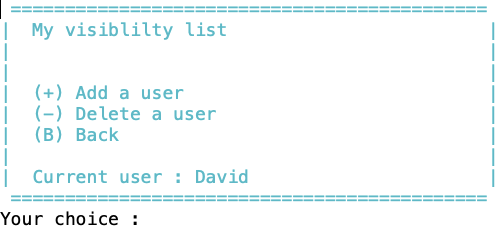

# Computer Science II
## Project - Database

This project is part of  Computer Science II (CSCE 156) for Fall 2023 
in the [School of Computing](https://computing.unl.edu) 
at the [University of Nebraska-Lincoln](https://www.unl.edu).

## Overview

### Lab Objectives & Topics

After completing this lab, you should be able to:
* Establish a JDBC connection to a database server
* Use JDBC to query and process a result set from a database server
* Use JDBC to insert new data into or delete existing data from a database
* Design database tables in 3NF (Third Normal Form) 


### Peer Programming Pair-Up

At the beginning of each project, you may find a team member on your own.  Please ***sign
up for a group on Canvas*** (`People` then `Groups`), and only one member of your group needs to
submit your project on Canvas.

## 1. Relation to Project 1

This project is independent of Project 1, although both projects develop Jstgram. You do not need to use your code from Project 1. In fact it is recommendeded not to use your Project 1 code due to the significant differences between the projects.


## 2. Social Media Application - Jstgram

In this project, we will design and develop a database version for *Jstgram*. 

### 2.1 Database

All information should be stored on the database server `cse-linux-01.unl.edu`. Please write a MySQL initialization script to set up the database, such as creating tables and inserting initial user and post data as specified below, before Jstgram starts.

### 2.1 Users

To simplify the project, your applicaion does not need to support adding or deleting users. Instead, we will use the MySQL initialization script to add a predefined group of users into the database. 

A user can log into Jstgram using their unique username and password. 

Your MySQL initialization script should add the following information to the database before Jstgram starts.
*  Four users with usernames: Alice, Bob, Crystal, and David, and their respective passwords: Alice123, Bob123, Crystal123, David123.

### 2.2 Posts

To simplify the project, your application only needs to support the text posts. User can publish text posts only (no text art posts as in Project 1).

Your MySQL initialization script should add the following information to the database before Jstgram starts.
  * Alice posted "Project deadline extended?" at 19:00:00 on October 12, 2023.
  * Bob posted "Yep" at 19:01:00 on October 12, 2023.
  * David posted "Fall break" at 09:00:00 on October 16, 2023
  * Alice posted "Lab due tonight?" at 23:30:00 on October 27, 2023
  * Crystal posted "No, it's due next week" at 23:35:00 on October 27, 2023

### 2.3 Post Visibility

Users can control the visibility of thir posts. Posts are alwasy visible to the poster and can be made visible to selected users. Specifcially, each user maintains a visibility list and the posts of the users are visible to the users in the visibility list.

Your MySQL initialization script should add the following information to the database before Jstgram starts.
  * Alice's posts are visible to Bob and Crystal
  * Bob's posts are visible to Alice and Crystal
  * Crystal's posts are visible to Alice
  * David's posts are not visible to other users.

  
## 3. Jstgram Windows

### 3.1 Main Window

When Jstgram starts, it should first connect to the database server and retrieve the current number of users in the database (as added by your MySQL initialization script). If successful, it displays that information in the *Main Window* as shown below. 

<p align="center">

</p>  

It then prompts for the username and password. If these credentials match the information in the database, this user becomes the current user, and Jstgram proceeds to the *Account Window*.

### 3.2 Account Window

The *Account Window* for Alice is shown belown as an example. 

<p align="center">

</p>  
 
The current user can choose to view posts, edit post visibility, or quit the application.

### 3.3 Post Window

The *Post Window* lists all posts by the current user and all posts visible to them, in the *ascending* order of post times. 

Below are examples of the *Post Window* for Alice, Bob, Crystal, and David, respectively, based on the database initialized with your MySQL script. Note that different users see different lists of posts.

<p align="center">


</p>  

The current user can choose to publish a new post, or return back to the *Account Window*. If a new post is published, the database and the *Post Window* should be updated accordingly.

### 3.4  Visibility Window

The *Visibility Window* shows the list of users who can see the posts of the current user.

Below are examples of the Visibility Window for Alice, Bob, Crystal, and David, based on the database initialized with your MySQL script.

<p align="center">



</p>  

The current user can choose to add a user to their visibility list, delete a user from their visibility list, or go back to the account window. If a user is added or deleted, the database and the *Visibility Window* should be updated accordingly.

Note that, only a user already in the database can be added to the visibility list, and only a user already in the visibility list can be deleted from the visibility list.

## 4. Project Requirement

### 4.1 Database design

Design a database to capture the following information

  * User details: userID, username, password, visibility list, 
  * Post details: postID, postText, postTime, the user who published the post

Feel free to add additional information as needed. Feel free to name your tables and attributes. If you plan to use natural join, ensure at least one common column between the two tables.

Your tables must adhere to the third normal form (3NF), meaning they should have no group of values for an attribute, no partial dependencies, and no transitive dependencies.

You will write the MySQL initizliation script from scratch. Name it `dbinit.sql`.

***Recommendation***

  * Utilize `auto_increment` for primay keys to avoid keeping track of the largest integer in Java when inserting new rows.
  * Use only `int`, `varchar(n)`, and `char(n)` data types that we have studied and are famaliar with.
  * For postTime (i.e., the date and time of a post), use `LocalDateTime.now()` in Java to get current date and time, formatting it as a string with  `postTime.format(DateTimeFormatter.ofPattern("yyy-MM-dd'T'HH:mm:ss")` for storage in the database. 
  * If necessary,  use the more flexible `on` clause for join select statement. For example, `Table1 natural inner join Table2` is equivalent to `Table1 inner join Table2 on Table1.col=Table2.col` if they have a common column `col`. The `on` clause is more flexible because it can join two tables on columns with different  names or only some commnon columns.

### 4.2 Java code design

Write your Java program to correctly show the necessary information in each window (e.g., list of posts in the *Post Window*). The exact format of the windows can differ from the provided screenshots.

You will write all code from scratch. Define appropriate Java classes, such as 
* `Main.java' as the main class for ease of execution by LAs
* `Database.java` containing database connection details as `public final static String` for easy modification by LAs.

```Java
public class Database {
	// JDBC driver parameters
	public final static String hostname = "cse-linux-01.unl.edu";
	public final static String username = "xxx"; // your database username
	public final static String password = "xxx"; // your database password
	public final static String url = "jdbc:mysql://"+hostname+"/"+username;

   ...

}
```

***Recommendation***
  * Add comprehensive comments for clarity
  * Adhere to good coding practices to be discussed in lab sessions by LAs.
  

## 5. Grading and Submitting Your Project

 
### 5.1 Submitting to Canvas

Submit the following to Canvas (not CodePost). 


1. `Project2.zip`: A Zip file of all source code.
  * `dbinit.mysql` - the MySQL initilization script 
  * `Main.java`, `Database.java`, and all other Java source files.

2. `design.pdf`: Design document described in the next section.

Again, if you plan to work with one other student for this project, please sign
up for a group on Canvas (`people` then `Groups`), and only one member of your group needs to
submit your project on Canvas.

### 5.2 Grading by LAs

#### 5.2.1. Design Document (40 points)

  * ER Diagram (5 points) : Present an Entity-Relational (ER) Diagram illustrating all your database tables and their relationships. You can utilize tools like  MySQL Workbench or free https://drawsql.app/ for automatic generation of an ER Digram from your MySQL code. 

  * UML Diagram (5 points) : Display a Unified Modeling Language (UML) diagram to represent all your Java classes and their relationships. The PlantUML plugin for Eclipse can be employed to automatically generate a UML diagram from your Java code.

  * 3NF Complicance (10 points) : Provide a justification for 3NF compliance of all your database tables.
  
  * Mapping (10 points) : Describe the correspondence between database tables and Java classes, include a briefly rationale. For example, identify which Java class stores the data of each database table?

  * Synchronization (10 points): Describe how you synchornize your Java data with the data on the database server, along with a breifly justification. For example, outlining when to load which data from the database server to Java? when to save which data from Java to the database server?

Note: the mapping and synchrinization questions are open-ended; a clear descripotion and justication of your design choices are crucial.

#### 5.2.2. Code (60 points): 

  * MySQL Initilization Script (10 points): Succssefully create the tables and insert the predefined data into the database.
  
  * Main Window (10 points): Correctly display the current number of users. 

  * Account Window (10 points): Correctly validate the username and password before entering the Account Window. 

  * Post Window (20 points): Correct post display and functionality for new posts.

  * Visibility Window (20 points): Correct visibility list display and functionality for editing the list.  

#### 5.2.3. Bonus (35 points)
  
  * Create New Accounts (Bonus 5 points): Enable users to create new accounts.
  
  * Delete Accounts (Bonus 5 points): Allow users to delete their current account. Ensure complete removal of user data, including username, password, visibility, and posts, from the database in the correct sequence.  

  * Comments and Coding Style (Bonus 5 points): Attend lab sessions for detailed grading criteria on comments and coding style.

  * Like Posts (Bonus 20 points):  Permit users to like posts visible to them. The like information should be accessible to all users who can view the post. Design a new table or add a new attribute to existing tables, ensuring continued adherence to 3NF.

  
You are encouraged to demonstrate the functionality of your Jstgram, particularly the bonus features, to our LAs for feedback and assessment.
 
### 5.3 Grading by the instructor (Additional bonus points)

Write a report to study and compare the performance of various data retrieval methods from the database server to Java. 

For example, let's consider the list of posts in the *Post Window*, which includes all posts published by the current user and all posts visible to them. One possible method involves a single well-designed join select statement to directly retrieve these posts from the database server. Alternatively, one could first use a select statement to retrieve the list of users whose posts are visible to the current user, followed by one or more select statements to retrieve their posts from the database server. Both methods are suitable for this porject, but they offer differing different performance levels.    

  * Points: Earn an additional up to 60 bonus points
  
  * Grading: The instructor will grade this report.

  * Submission: Submit your report `study.pdf` to "Project 2 Bonus - Performance Study" on Canvas.
  
  * Methods to study: Design and implement several different methods for data retrieval from the database server to Java. 

  * Performance metrics: Investigate and identify methods to (automatically or manually) measure the total database runtime for all your statements and/or the total network traffic between the database server and your Java code. You may also consider other performance metrics, subject to instructor approval.

  * Dataset: Develop code to populate your database with a given number of randomly generated users, posts, and visibility settings.

  * Experiments: Design and execute experiments to measure the aforementioned performance metrics while progressively increasing the database size. For example, vary the number of randomly generated users/posts varying from 10, to 1000, 100000, or more. Be cautious to avoid overloading the database server.
    

## Credit

This project was originally designed by Jianghao Wang. Both David Ryckman and Olwen Nguyen helped to revise and improve it. 
