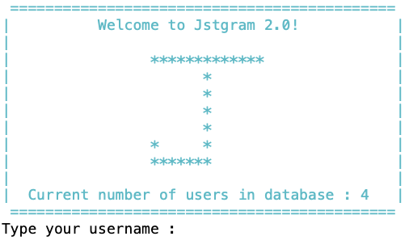
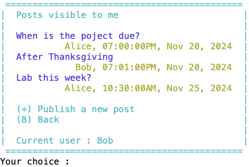
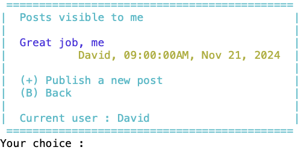

# Computer Science II
## Project - Database

This is a project used in Computer Science II (CSCE 156) for Fall 2023 
in the [School of Computing](https://computing.unl.edu) 
at the [University of Nebraska-Lincoln](https://www.unl.edu).

## Overview

### Lab Objectives & Topics
After completing this lab, you should be able to:
* Establish a JDBC connection to a database server
* Use JDBC to query and process a result set from a database server
* Use JDBC to insert new data into or delete existing data from a database
* Design database tables in 3NF (Third Normal Form) 


### Peer Programming Pair-Up

At the beginning of each project, you may find a team member on your own.  Please ***sign
up for a group on Canvas*** (`People` then `Groups`), and only one member of your group needs to
submit your project on Canvas.

## 1. Relation to Project 1

This project is independent of Project 1, although both projects develop Jstgram. You do not need to use use your code from Project 1. In fact it is recommendeded not to use your Project 1 code due to the significant differences between the projects.


## 2. Social Media Application - Jstgram

In this project, we will design and develop a database version for *Jstgram*. 

### 2.1 Database

All information should be stored on the database server `cse-linux-01.unl.edu`. Please write an MySQL init code to initialize the database, such as creating all the tables and inserting the initial user and post data into these tables, before Jstgram starts.

### 2.1 Users

To simplify the project, your applicaion does not need to support adding or deleting users. Instead, please add a group of users into the database in your MySQL init code. 

A user can log into Jstgram using their unique username and password. 

Your MySQL init code should add the following information into the database before Jstgram starts.
*  a total of four users with usernames: Alice, Bob, Crystal, and David, and their passwords: Alice123, Bob123, Crystal123, David123, respectively.

### 2.2 Posts

To simplify the project, your application only needs to support the text posts.  That is, a user can publish only text posts (no more text arts in project 1).

Your MySQL init code should add the following information into the database before Jstgram starts.
* Alice posted "Project deadline extended?" at 19:00:00 on October 12, 2023.
* Bob posted "Yep" at 19:01:00 on October 12, 2023.
* David posted "Fall break" at 09:00:00 on October 16, 2023
* Alice posted "Lab due tonight?" at 23:30:00 on October 27, 2023
* Crystal posted "No, it's due next week" at 23:35:00 on October 27, 2023

### 2.3 Post Visibility

A user can choose to which users the posts of the user are visible. Only these users can view the posts published by the user.
Note that the posts of a user are always visible to themself.

Your MySQL init code should add the following information into the database before Jstgram starts.
* Alice's posts are visible to Bob and Crystal
* Bob's posts are visible to Alice and Crystal
* Crystal's posts are visible to Alice
* David's posts are visible to no other users.

  
## 3. Jstgram Windows

### 3.1 Main Window

When Jstgram starts, it should first connect to the database server and get the current number of users in the database (i.e., the users already added by your MySQL init code). If successful, it displays that information in the *Main Window* as demonstrated below. 

<p align="center">

</p>  

It then reads the username and password from the keyboard. If the username and password match with the information in the database, this user becomes the current user and Jstgram goes to the *Account Window*.

### 3.2 Account Window

The *Account Window* is demonstrated below for Alice. 

<p align="center">

</p>  
 
The current user can choose to view the posts, edit post visibility, or quit the application.

### 3.3 Post Window

The *Post Window* lists all the posts by the current user and all the posts visible to the current user in the *ascending* order of the post times. 

For the database initizlized using your MySQL init code, below are the *Post Window* for Alice, Bob, Crystal, and David, respectively. Note that the *Post Window* shows different lists of posts to these users. 

<p align="center">




</p>  

The current user can choose to publish a new post, or go back to the account window.

If publishing a new post, the database should be updated and the post window should also be updated.

### 3.4  Visibility Window

The *Visibility Window* lists all the users to whom the posts of the current user are visible.

For the database initizlized using your MySQL init code, below are the *Visibility Window* for Alice, Bob, Crystal, and David, respectively. 

<p align="center">


</p>  

The current user can choose to add a user to their visibility list, , delete a user from their visibility list, or go back to the account window.

If adding or deleting a user, the database should be updated and the *Visibility Window* should also be updated.

Note that, only a user already in the database can be added to the visibility list, and only a user already in the visibility list can be deleted from the visibility list.

## 4. Project Requirement


### 4.1 Database design

Use the methods that we studied about relational database to design a database to describe the following information
* each user: userID, username, password, visibility list, 
* each post: postID, postText, postTime, the user who published this post
Please add more information if necessary. Feel free to name your tables and attributes. Make sure that two tables have at least one common column if you plan to join these two tables using natual join.

Make sure that your tables conform to the third normal form (3NF). That is, no group of values for an attribute, no partial dependency, and no transitive dependency.

***Recommendation***
* Please use `auto_increment` for your primay key of a table so that you do not need to keep track of the current largest integer in your java code when inserting a new row.
* Please use only `int`, `varchar(n)`, and `char(n)` data types that we have studied in the class.
* For postTime (i.e., the date and time of a post), you may use `LocalDateTime.now()` to get current date and time in Java and convert it to a string using  `postTime.format(DateTimeFormatter.ofPattern("yyy-MM-dd'T'HH:mm:ss")` and then save it as a string (e.g., `varchar(n)` or `char(n)`) in the database. 
* If necessary, you may use the more flexible `on` clause for join select statement. For example, `Table1 natural inner join Table2` is equivalent to `Table1 inner join Table2 on Table1.col=Table2.col` if they have a common column `col`. The `on` clause is mor flexible because it can join two tables using two columns even with different column names or using only some but not all commnon columns.

### 4.2 Java code design

Your Java program must correctly show all the necessary information in each window (e.g., list of posts in the *Post Window*), although you does not need to follow the same window formats as demonstrated above (e.g., the borders of a window, the width of a line).

No code is provided to you for this project, so you have to write all the code for this project from scratch. Please define appropriate classes for your project
* The main class should be named `Main.java`, so that it is easier for our LAs to run your code
* The information of hostname, database username, and database password should be saved as `public final static String` in the `Database` class, so that it is easier for our LAs to modify these information. Because our LAs will change the database username and password to their information before runing and grading your code.

```Java
public class Database {
	// JDBC driver parameters
	public final static String hostname = "cse-linux-01.unl.edu";
	public final static String username = "xxx"; // your database username
	public final static String password = "xxx"; // your database password
	public final static String url = "jdbc:mysql://"+hostname+"/"+username;

   ...

}
```

***Recommendation***
* Please add as more comments in your code as possible to help our LAs to understand your code
* Please follow good coding style also to help our LAs to understand your code. ***Our LAs will talk about good coding styles in the lab sessions***.


## 5. Grading and Submitting Your Project

 
### 5.1 Submitting to Canvas

Please submit the following files to Canvas (not CodePost).Our LAs will manually grade them. You are welcome to demonstrate how your Jstgram works to our LAs, and they can then give you their feedbacks and grade your project.  

Again, if you plan to work with one other student for this project, please sign
up for a group on Canvas (`people` then `Groups`), and only one member of your group needs to
submit your project on Canvas.

1. A Zip file of all your source code named `Project2.zip`
* the MySQL init code named `dbinit.mysql`
* Java source files: The main class named `Main.java`, the database class named `Database.java`, and all other Java source files.

2. Design document named `design.pdf`
* Database: Justify that all your tables conform to 3NF.
* Database: Plot the Entity-Relational (ER) Diagram to show all your database tables and their relations. May use MySQL Workbench or free https://drawsql.app/ to automatically generate an ER Digram from your MySQL code. 
* Java: Plot the Unified Modelling Language (UM) diagram to show all your java classes and their relations. May use the PlantUML plugin fo Eclipse to automatically generate an UML diagram from your Java code. 
* Overall: Describe the mapping between database tables and Java classes. Specifically, for each database table, which Java class is used to store the data of the table?
* Overall: Describe how you synchornize your Java data with database data. For example, when to load which data from the database to Java? when to save which data from Java to database?

***note that, many of the above questions are open ended. That is, there are multiple possible correct solutions. We are looking for your clear descripotion and brief justication of your design choice.***

### 5.2 Grading by LAs

* (50 points) Grading your design document. Same points for each bullten point in the design document.
* (50 points) Grading your code
   * (10 points) Main Window: Your code shows the correct *Main Window* (information not the format). 
   * (10 points) Account Window: Your code correctly checks the username and password and then show the *Account Window*. 
   * (20 points) Post Window: Your code shows the correct list of posts for each user in the *Post Window*. A new post can be succesfylly published.
   * (20 points) Visibility Window: Your code shows the correct visibility list for each user in the *Visibility Window*. The visibility can be succesfully edited (i.e., add and delet users).  
* (Bonus points) 
  * (Bonus 5 points) Create new accounts: A user can create a new account.  
  * (Bonus 5 points) Delete accounts: A user can successfully delete the current account. All the data of the user, such as username, password, visibility (the user and others), and posts, should be deleted from the database. Note that the data should be deleted from various tables in the correct order.  
  * (Bonus 10 points) Comments and coding style: Please attend the lab sessions for more information about grading comments and coding style.
  * (Bonus 20 points) Like posts:  A user may like a post visible to the user. The like information of a post should be visible to all the users who can view the post. Please design a new table or add a new attribue to existing tables, and make sure your tables still confirm to 3NF. 
  * (Bonus 60 points) Experimental study: Write a separate pdf file `study.pdf` to design and conduct experiments and report and discuss your experiment results.
        * Initialize your database to have a large number of randomly generated users, posts, and visibility settings.
        * Explore and find methods to (automatically or manually) measure the total database running time and/or total amount of network traffic between the database server and your Java code, and/or other performance metrics confirmed by the instructor.
        * Design and conduct experiments to measure the above performance metrics as you increasing the database size, for example, number of randomly generated users/posts varying from 10, to 1000, 100000, or more (be careful not overloading the database server)
        * Design and implement several different ways to synchronzize the Java data and database data. 
    

## Credit

This project was originally designed by Jianghao Wang. Both David Ryckman and Olwen Nguyen helped to revise and improve it. 
